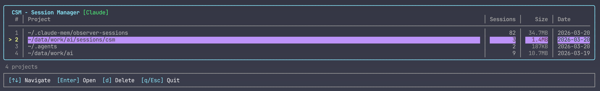
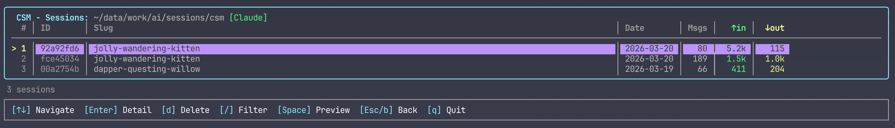

# csm — Claude Session Manager

A terminal UI for browsing and managing [Claude Code](https://claude.ai/code) and [OpenAI Codex](https://github.com/openai/codex) session files.

Navigate projects and sessions, search by content, view token usage and tool calls, rename and delete sessions — all from the terminal.

## Screenshots

**Projects view** — lists all projects grouped by working directory, with session count, total size and last-modified date.



**Sessions view** — lists all sessions in the selected project with ID, slug, date, message count and token usage (input ↑ / output ↓).



## Features

- **Two providers** — Claude Code (`~/.claude/projects/`) and OpenAI Codex (`~/.codex/sessions/`), switchable via `--source`
- **Project view** — groups sessions by working directory; shows session count, total file size, last-modified date
- **Session list** — shows slug/title, date, message count, input/output token estimates
- **Detail view** — accurate token counts (tiktoken), tool call statistics, changed file list, message preview
- **Search & filter** — `/` to enter filter mode, fuzzy-matches slug and message content
- **Batch delete** — filter + `Space` to select multiple sessions, `d` to delete all at once
- **Rename** — `r` in detail view to rename a session (writes `custom-title` record for Claude, updates `session_index.jsonl` for Codex)
- **Provider badge** — `[Claude]` or `[Codex]` shown in every view's title bar

## Requirements

- [Bun](https://bun.com) v1.3+

## Install & Run

```bash
git clone https://github.com/borneygit/csm
cd csm
bun install
bun run dev                        # Claude Code sessions (default)
bun run dev -- --source codex      # OpenAI Codex sessions
```

## Build standalone binary

```bash
bun run build                      # compiles to ./csm
./csm                              # Claude Code sessions (default)
./csm --source codex               # OpenAI Codex sessions
./csm --path /custom/dir           # custom projects directory
./csm --help                       # show usage
./csm --version                    # print version
```

## Providers

| Flag | Source | Default directory |
|------|--------|-------------------|
| `--source claude` (default) | Claude Code | `~/.claude/projects/` |
| `--source codex` | OpenAI Codex | `~/.codex/sessions/` |

The active provider is shown as `[Claude]` or `[Codex]` in the title bar of every view.

## Key Bindings

| View | Key | Action |
|------|-----|--------|
| All | `q` / `Esc` | Quit / go back |
| Projects / List | `↑` `↓` | Navigate |
| Projects / List | `Enter` | Open |
| Projects / List | `d` | Delete (prompts confirmation) |
| List | `/` | Toggle search filter |
| List | `Space` | Preview first message |
| List (filter) | `Space` | Toggle selection |
| List (filter) | `d` | Delete selected sessions |
| Detail | `r` | Rename session |

## Architecture

```
src/
├── index.tsx              # entry point, parses args, renders App
├── components/
│   ├── App.tsx            # state, view orchestration, key bindings
│   ├── ProjectView.tsx    # project list
│   ├── ListView.tsx       # session list with filter/selection
│   ├── DetailView.tsx     # token stats, tool calls, file list, messages
│   └── StatusBar.tsx      # context-aware keyboard hints
├── providers/
│   ├── IProvider.ts       # provider interface
│   ├── ClaudeProvider.ts  # Claude Code implementation
│   ├── CodexProvider.ts   # OpenAI Codex implementation
│   └── index.ts           # createProvider factory
├── scanner.ts             # scans ~/.claude/projects/, decodes dir names
├── parser.ts              # parses JSONL, extracts metadata and token counts
└── types.ts               # ProjectMeta, SessionMeta, SessionDetail
```

## Tech Stack

- [Ink](https://github.com/vadimdemedes/ink) — React for CLIs
- [js-tiktoken](https://github.com/dqbd/tiktoken) — accurate token counting (`cl100k_base`)
- [Bun](https://bun.com) — runtime and bundler
